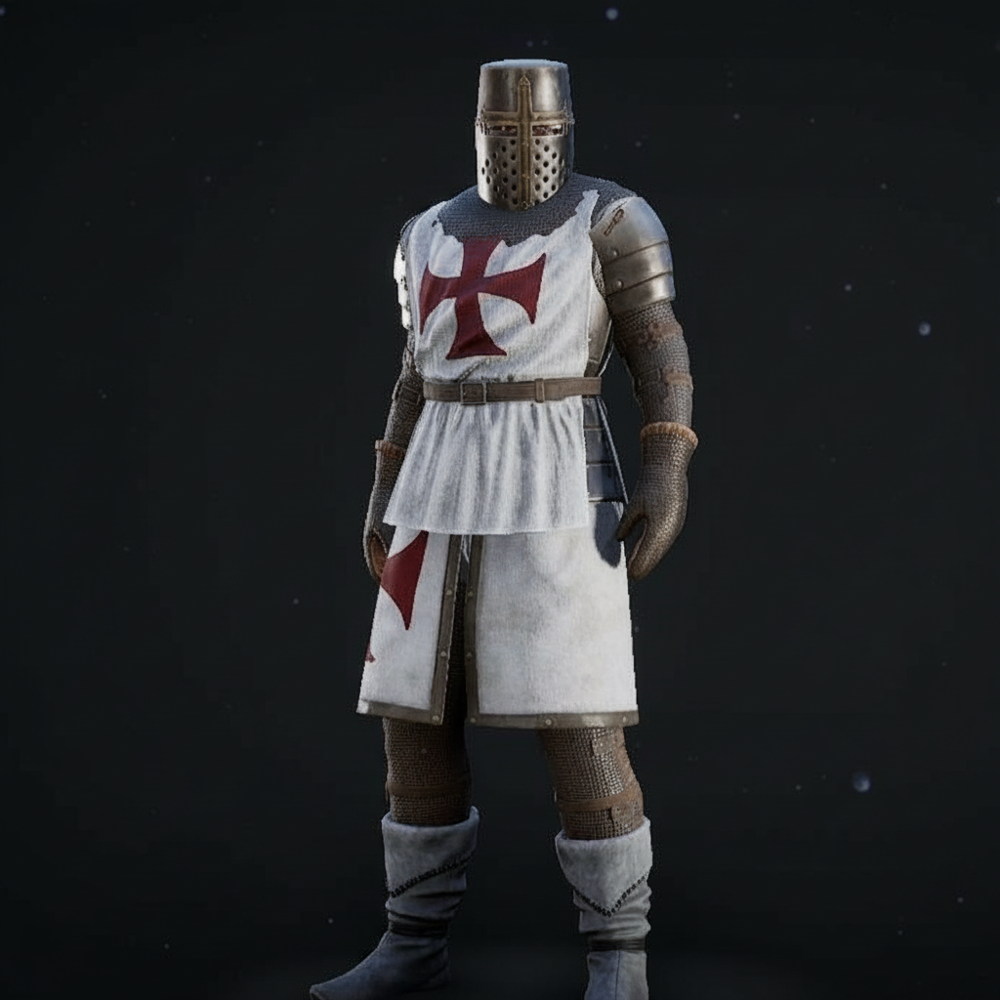

# The Frame Protagonist

Art direction for the player character of the Mode A frame narrative — Master
Prompt Section 2: *"a literate knight, a monastic envoy, or a scribe attached to a
military order."* The reference settles that choice: **a knight of a military
order, Templar-presenting.**

Reference images: [`reference/character/`](reference/character/) — front, front-lit,
three-quarter, side, back.

## The look

| Element | Description |
|---|---|
| Surcoat | White, knee-length, split for riding. Red cross pattée on the chest and repeated on the skirt. |
| Head | Flat-topped cylindrical great helm, face plate with cross-slit occularium and drilled breaths. Mail coif beneath. |
| Torso | Solid plate cuirass under the surcoat, with an articulated lamed skirt (fauld) below the belt. |
| Arms | Plate pauldrons and rerebraces over mail sleeves; mail mittens. |
| Legs | Mail chausses, plate poleyns at the knee, tall soft boots with turned-over cuffs. |
| Palette | Bleached white cloth, oxblood cross, dark browned steel, unpolished. Worn, not gleaming. |

The silhouette is the point: a tall, anonymous, flat-topped column of white and
steel with no face. That anonymity is worth protecting — this is a character whose
job is to carry other people's testimony, and a man with no visible face reads as
a vessel rather than a hero. Keep the helm on in most framing.

**Tone note (Pillar 2).** The reference renders are clean studio presentations.
In game, this kit should be dirty, sun-bleached, and repaired: the Levant is hot,
the orders were not rich in the field, and a surcoat that stays white is a surcoat
nobody has worked in.

## Historical audit

Flagged per Standing Rule 1 — *"flag any historical claim in my design that you
believe is inaccurate or overstated, before writing code around it."* This is art
direction rather than a claim about the sources, but the project's entire thesis is
that it handles history carefully, and the armour as drawn is the single most common
error in Templar depictions. Better a deliberate choice than an accidental one.

**What is right:**

- **The red cross pattée on white.** The Templars received the red cross from
  Eugenius III in 1147. Correct for any date after that, which covers the whole of
  the Crusader Levant period the frame narrative describes.
- **The surcoat over mail**, knee-length and split. Correct from the mid-12th
  century on.
- **Mail chausses and coif.** Correct throughout.

**What is out of period, and by how much:**

| Element | As drawn | Actually |
|---|---|---|
| Flat-topped great helm | c. 1210–1250 | A knight in 1150 wears a conical nasal helm; an enclosed helm appears c. 1180–1200. **~60–100 years early** for the mid-12th century. |
| Plate pauldrons and rerebraces | c. 1350+ | 12th century is mail sleeves over a padded gambeson. Plate arm defences begin late 13th c. **~200 years early.** |
| Solid plate cuirass | c. 1350+ | The coat-of-plates (cloth-covered plates) is late 13th c. at the earliest. **~200 years early.** |
| Articulated fauld | c. 1400+ | The hauberk's own mail skirt does this job. **~250 years early.** |
| Soft turned-over boots | — | Reads late-medieval or fantasy. A 12th-c. knight has leather soles laced to his chausses. |

The reference mixes a roughly 1220 head with a roughly 1350–1450 body. That is a
completely coherent *cinematic* Templar and a perfectly legitimate art direction —
it is simply not a 12th-century one, and the frame narrative currently says 12th
century.

## Resolved: option A

**The frame era is c. AD 1229.** The look stands as drawn; the narrative moved to
meet it. The great helm is now right, the arm and torso plate remain early by about
a century rather than two, and `UWitnessMissionSubsystem::FrameYearAD` carries the
date as a data field. The options as they were put:

### Three ways to resolve it

**A. Keep the look; move the frame era to c. 1220–1250.** *(Recommended.)*
The helm becomes exactly right. The arm and torso plate stay early, but by a
century rather than two, and at a glance the kit reads correctly. This costs
nothing in code — the frame era is a data field — and the period is a *better*
setting for the premise than 1150:

- Frederick II's 1229 treaty returns Jerusalem to Christian hands without a
  battle, and the Templars, who opposed the deal, hold a city they did not want
  handed back on those terms. A Templar-attached scribe working in that Jerusalem
  has friction built in before anything is written.
- The Khwarazmian sack of Jerusalem in 1244 is a hard clock on any
  manuscript-recovery campaign.
- Constantinople is under Latin rule (1204–1261), which makes a manuscript hunt
  there plausible in a way it is not in 1150.

**B. Keep the 12th century; correct the armour.** Mail hauberk and coif, gambeson,
surcoat, conical nasal helm or an early enclosed helm, kite shield. Historically
tight, and a leaner, less armoured silhouette that arguably suits a scribe better
— but it gives up the iconic Templar shape most people picture.

**C. Keep both, and say so.** Declare the frame era deliberately non-literal. Valid,
and plenty of good games do it — but it sits badly against a project whose selling
point is that it does not fudge the record, and it is the one option that would
give an informed player a reason to doubt the rest.

Chosen: **A**.

## How this connects to the systems already built

- **Mode A / Mode B (Section 3).** This character exists only in Mode A. Mode B has
  no crusader frame at all, so the whole kit is Mode-A content and must not be
  wired into anything the first-century layer depends on.
- **Task 8, the Witness Mission framework.** Era swap and controller swap are
  exactly the boundary this character sits on: the frame protagonist is one
  controller and tuning set; Peter, Mark, Luke, Paul or a companion is the other.
  The frame era's *year* is a field this task will need.
- **The Codex.** The frame protagonist is the one assembling it, and a Witness
  Mission is **a reconstruction he is performing** — decided. Everything in his
  Codex is available inside one, including sources written after the year the scene
  is set in, because he is the one putting it together. The scene stays honest
  because era gating still evaluates at the mission's year: no NPC refers to
  something that has not happened to him.
